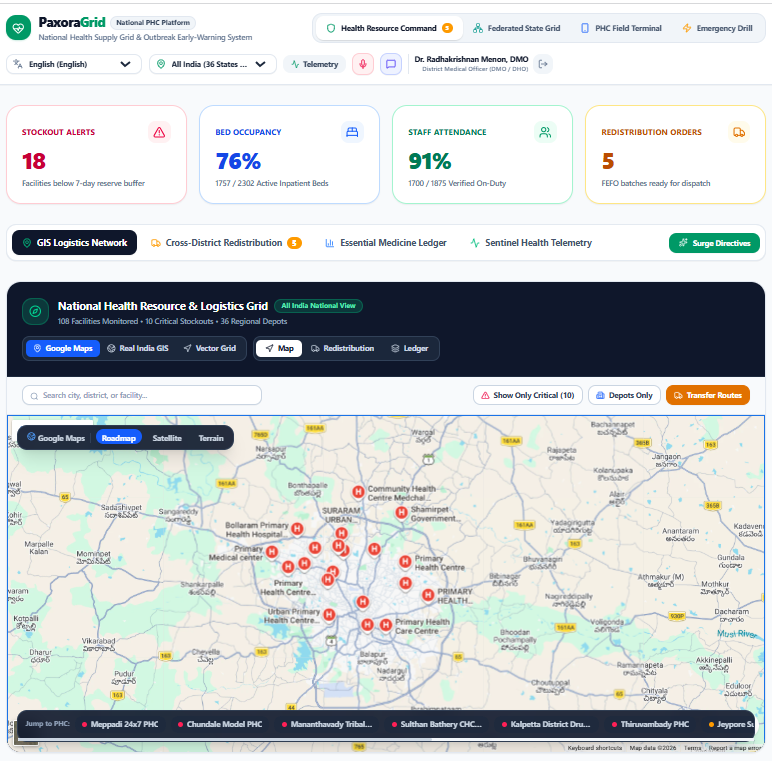
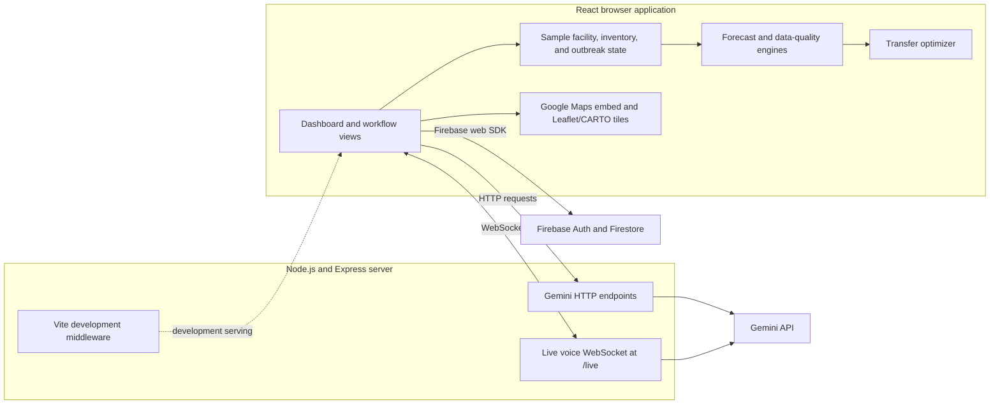

# PaxoraGrid

PaxoraGrid is a prototype command platform for monitoring health-facility resources and coordinating essential-medicine redistribution across India's Primary Health Centres (PHCs). It combines a district health dashboard, facility reporting, demand-risk estimates, and transfer workflows in one interface.

> **Project status:** This repository is a demonstration prototype, not a production health information system. Much of the facility, inventory, outbreak, and telemetry data is sample data. Do not use its forecasts, generated guidance, or compliance claims for clinical or operational decisions.



## Proposed Solution

PHC resource and medicine-shortage signals are often spread across separate reporting and logistics workflows. PaxoraGrid demonstrates how a shared command view could help authorized health administrators spot low-stock and capacity risks, review suggested transfers, and collect updates from field facilities.

The prototype brings those workflows together while keeping forecasting and transfer suggestions explainable in code. A future production deployment would need verified government data integrations, validated forecasting, operational security controls, and clinical and legal review.

## How It Works

1. **Collect:** The dashboard starts with representative facility, inventory, drug, and outbreak data. Field staff can enter bed, staffing, and stock updates.
2. **Estimate risk:** A client-side forecast engine estimates days of stock cover and stockout risk. Active outbreak scenarios increase estimated demand for affected facilities and medicines.
3. **Suggest transfers:** A client-side optimizer matches shortages to donor stock, considering safety buffers, distance, state boundaries, expiry, and cold-chain constraints.
4. **Review and act:** Administrators can inspect facility status, review or approve transfer recommendations, and view the federated-grid and outbreak-simulation screens.
5. **Connect services:** Firebase provides Google sign-in and persistence for supported reports and approved transfers. The Express server proxies optional Gemini features and a live-voice WebSocket connection.

## System Architecture



## Features

- **Health resource command:** Facility capacity, staffing, medicine inventory, estimated days of cover, risk indicators, and transfer recommendations.
- **Facility map:** Google Maps Embed API for Roadmap and Satellite when configured, plus a Leaflet map layer using CARTO tiles. Terrain and keyless use retain the existing Google Maps embed fallback.
- **Federated state grid:** State-node and model-metric visualization with a demo training-round interaction.
- **PHC field terminal:** Update facility details and medicine counts through a field-report workflow.
- **Outbreak simulator:** Trigger sample outbreak scenarios and inspect their effect on risk and suggested transfers.
- **Transfer workflow:** Review, modify, approve, or reject proposed transfers; supported approved transfers are written to Firestore for signed-in users.
- **Gemini assistance:** Optional chat, advisory, search-grounding, register-digitization, and live voice features, with fallback behavior when the key is unavailable.
- **Localization:** Translation context and language selection are included in the interface.

## Technology Stack

| Area | Technologies |
| --- | --- |
| Frontend | React 19, TypeScript, Vite 8 |
| Styling and icons | Tailwind CSS 4, Lucide React |
| Maps | Leaflet, Google Maps embed, CARTO tiles |
| Backend | Node.js, Express, WebSocket (`ws`) |
| Authentication and persistence | Firebase Authentication, Cloud Firestore |
| Generative AI | Google GenAI SDK, optional server-side API key |
| Motion | Motion |

## Requirements

- Node.js 20.19+ or 22.12+ and npm.
- A modern browser and an internet connection for hosted map tiles and external service features.
- A Firebase project only if you need Google sign-in or Firestore persistence. Demo administrator access is available without Firebase sign-in.
- A `GEMINI_API_KEY` only if you want Gemini-backed features. Core demo screens can run without it.
- A Google Maps Embed API key if you want the keyed Roadmap and Satellite embed. The existing keyless map fallback remains available.

## Run Locally

1. Install dependencies:

   ```sh
   npm install
   ```

2. Optional: create a local environment file from the example.

   ```powershell
   Copy-Item .env.example .env
   ```

    Set `GEMINI_API_KEY` in `.env` to enable Gemini-backed features and `VITE_GOOGLE_MAPS_API_KEY` to enable the keyed Roadmap/Satellite embed. Both are optional; built-in fallbacks remain available.

3. Start the app:

   ```sh
   npm run dev
   ```

4. Open [http://localhost:3000](http://localhost:3000). Choose **Enter as Health Administrator (1-Click)** to explore the demo without setting up Google sign-in.

## Firebase Setup

The Firebase web configuration is loaded from [firebase-applet-config.json](firebase-applet-config.json). It points to a particular Firebase project and is not a substitute for configuring your own project.

To use a separate Firebase project:

1. Create a Firebase web app and update `firebase-applet-config.json` with its web configuration.
2. Enable Google as a sign-in provider in Firebase Authentication and configure the authorized domains.
3. Create the Firestore database whose ID is set in `firestoreDatabaseId` in the config.
4. Review and deploy [firestore.rules](firestore.rules) for your environment.

The Firebase web API key is a client identifier, not an authorization boundary. Protect data with Firebase Authentication and restrictive Firestore rules. Never put the Gemini API key in a client-side config file.

## Configuration

| Variable / file | Purpose | Required |
| --- | --- | --- |
| `GEMINI_API_KEY` | Enables server-side Gemini chat, advisory, digitization, and live voice integrations. | No; fallback behavior is available. |
| `VITE_GOOGLE_MAPS_API_KEY` | Enables the Google Maps Embed API for Roadmap/Satellite map modes. Vite includes this browser key in client assets. | No; the existing keyless map fallback remains available. |
| `PORT` | Changes the Express server port. Defaults to `3000`. | No |
| `firebase-applet-config.json` | Firebase web app and Firestore database configuration. | Only for Firebase sign-in and persistence. |

Enable the Maps Embed API and billing for the Google Cloud project associated with the Maps key. Because `VITE_GOOGLE_MAPS_API_KEY` is exposed to the browser, restrict it by allowed HTTP referrers and to the Maps Embed API. Terrain continues to use the existing keyless embed because the Maps Embed API supports Roadmap and Satellite map types.

## Demo Data and Limitations

- Facility, drug, inventory, outbreak, and federated-node data are initialized from local sample datasets in `src/data/`.
- `livePublicDataService.ts` currently returns in-repository sample telemetry. Its sync and diagnostics flows do not connect to live e-Aushadhi, HMIS, IDSP, or ABDM feeds.
- Forecasts and transfer recommendations are deterministic client-side heuristics, not validated medical or supply-chain forecasts.
- The federated training-round interaction updates demo metrics in the browser; this repository does not include a federated-learning server or model-training deployment.
- Some Gemini endpoints return simulated fallback responses when no API key is configured or an upstream request fails. Generated content must not be treated as medical advice.
- The interface's privacy or regulatory labels do not by themselves establish compliance. Production use requires a security, privacy, and regulatory assessment.

## Available Commands

| Command | Description |
| --- | --- |
| `npm run dev` | Start the Express server with Vite development middleware. |
| `npm run build` | Build the frontend into `dist/`. |
| `npm start` | Start the Node server. For production serving, first build and set `NODE_ENV=production`. |
| `npm run preview` | Preview the Vite production build locally. |
| `npm run lint` | Run the TypeScript check (`tsc --noEmit`). |

The server listens on `PORT` when set, otherwise on port `3000`.

## Project Structure

```text
src/
  components/   Dashboard, map, field logging, simulator, and modal UI
  context/      Translation context
  data/         Sample facilities, inventory, states, and other seed data
  services/     Firebase, Gemini-facing client services, forecasts, and optimization
  types/        Shared TypeScript domain types
server.ts       Express API and live-voice WebSocket bridge
firebase-applet-config.json
firestore.rules
docs/images/    README screenshots
```

## Security Notes

- Keep `.env` out of source control; it is ignored by Git. Use server-side environment variables for `GEMINI_API_KEY`.
- Treat `VITE_GOOGLE_MAPS_API_KEY` as a public browser key: restrict it by HTTP referrer and API; do not rely on hiding it in `.env`.
- Review Firebase Authentication settings and Firestore security rules before connecting non-demo users or data.
- Use synthetic or de-identified data during development. Do not put patient-identifiable health information into this prototype.
